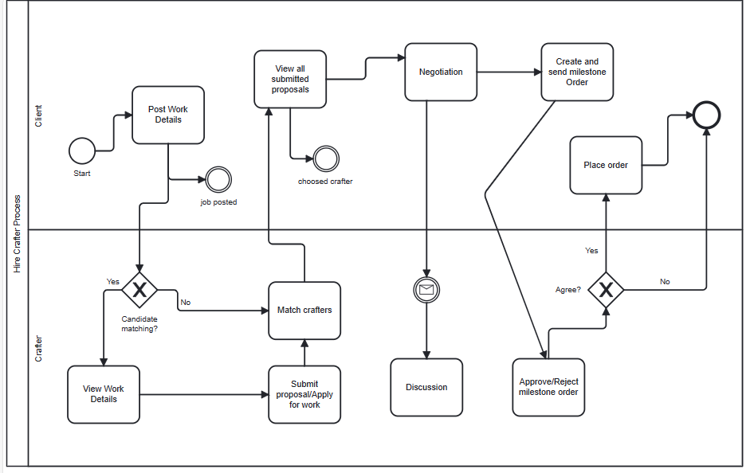

# Skilled Hands Platform

Skilled Hands is a talent provision platform designed to empower individuals with vocational skills and limited backgrounds. The platform serves as a bridge, connecting crafters and clients in need of skilled professionals. Below are the key functionalities and use cases of the Skilled Hands platform.

## Use Case #1: Create Profile and Post Functionality

### Register Account
Crafters and clients can easily sign up by providing their details, including name and contact information.

### Profile Optimization
Crafters optimize their profiles by adding detailed information about their experience, expertise, and location.

### Add Post
Crafters can create posts related to their vocational skills, such as painting, plumbing, carpentry, etc.

### Post Details
Crafters include comprehensive details about the work, including the nature of the task and the expected duration.

These functionalities enable crafters to build comprehensive profiles, showcasing their skills and credibility, facilitating efficient matching with clients based on location and expertise.

.png>)

## Use Case #2: Hire Crafter

This use case outlines the process of hiring crafters or skilled workers by clients/recruiters.

### Clients Post Work Details
Clients provide complete details about the work they need through the user panel.

### Crafters View Work Posts
Crafters with matching skills can view all available work posts on the crafter panel.

### Crafters Apply or Send Proposals
Crafters apply or send proposals for the work posts they find suitable.

### Clients View Proposals
Clients can view all active proposals on their specific work post.

### Clients Choose Top Crafters
Clients select the top crafters based on profiles, badges, and work experience.

### Negotiation and Agreement on Milestone
Clients and crafters negotiate and agree upon a milestone, which can be placed as an order on the platform.

## Use Case #3: Job Feedback

### Key Features

- **Client Reviews and Ratings**
  Clients can submit reviews and ratings for skilled workers, providing honest assessments of their performance.

- **Detailed Feedback**
  Clients have the option to provide detailed feedback, sharing experiences and highlighting specific aspects of the service.

- **Badges**
  Clients can award badges to workers based on work quality, punctuality, communication, and overall satisfaction.

- **Public Ratings**
  Combined ratings and evaluations are accessible to clients or the public, offering valuable information about the trustworthiness of each worker.

- **Suggestions for Improvement**
  Clients can provide brief feedback on the platform, offering suggestions for the worker's improvement and skill enhancement.

This feedback system enhances transparency and helps new customers make informed decisions about skilled workers.

.jpg>)